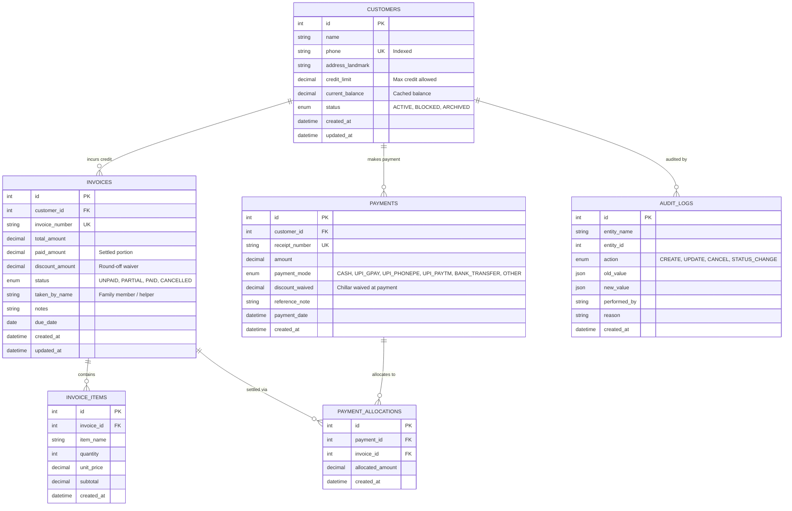
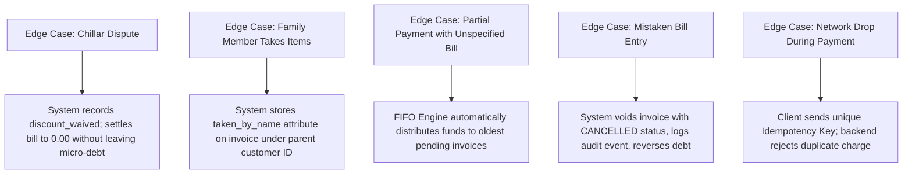

# System Architecture & Feature Specification: Shop Credit & Ledger System ("Udhaar Khata")

---

## 1. System Topology & Architectural Style

The system is designed as a **Headless, API-First, Decoupled Architecture**. The backend acts as a standalone financial computation engine and single source of truth, allowing any client interface (Mobile PWA, Desktop Web, Tablet POS, or Native App) to connect via standard REST APIs.

```
┌─────────────────────────────────────────────────────────────────────────────┐
│                              CLIENT TIER                                    │
│  ┌────────────────────────┐  ┌────────────────────────┐  ┌───────────────┐  │
│  │ Mobile PWA (Phone/Tab) │  │ Responsive Web (Desk)  │  │ Native App    │  │
│  └───────────┬────────────┘  └───────────┬────────────┘  └───────┬───────┘  │
└──────────────┼───────────────────────────┼───────────────────────┼──────────┘
               │                           │                       │
               └─────────────────► HTTPS / JSON ◄──────────────────┘
                                           │
┌──────────────────────────────────────────▼──────────────────────────────────┐
│                         APPLICATION / SERVICE TIER                          │
│                                                                             │
│  ┌───────────────────────── REST API Router ─────────────────────────────┐  │
│  │  • Customer Endpoint  • Invoices Endpoint  • Payments  • Analytics    │  │
│  └───────────────────────────────────────┬───────────────────────────────┘  │
│                                          │                                  │
│  ┌──────────────────────── Domain Engine Layer ──────────────────────────┐  │
│  │  • FIFO Settlement Engine             • Search Query Normalizer       │  │
│  │  • Round-Off & Chillar Allocator      • WhatsApp Message Generator    │  │
│  │  • Customer Credit Limit Guard        • Daily Aggregate Calculator    │  │
│  └───────────────────────────────────────┬───────────────────────────────┘  │
│                                          │                                  │
│  ┌────────────────────── Data Access / ORM Layer ────────────────────────┐  │
│  │  • ACID Transaction Manager           • Row-Level Locking (Pessimistic)│ │
│  │  • Decimal Precision Enforcer         • Audit Logger                  │  │
│  └───────────────────────────────────────┬───────────────────────────────┘  │
└──────────────────────────────────────────┼──────────────────────────────────┘
                                           │ SQL (InnoDB Engine)
┌──────────────────────────────────────────▼──────────────────────────────────┐
│                            DATA PERSISTENCE TIER                            │
│  ┌───────────────────────────────────────────────────────────────────────┐  │
│  │ MySQL 8.0 Relational Database                                         │  │
│  │  • Relational integrity with Foreign Keys                             │  │
│  │  • Decimal(10,2) financial precision storage                          │  │
│  │  • Composite and Prefix Indexes for sub-50ms lookups                  │  │
│  │  • Append-Only Audit Logging & Soft Deletion                          │  │
│  └───────────────────────────────────────────────────────────────────────┘  │
└─────────────────────────────────────────────────────────────────────────────┘
```

---

## 2. Domain Data Architecture & Entity Relationships

The data model uses an **Invoice-Payment Allocation Model (FIFO-compatible)**. It avoids direct balance mutation without traceability, preserving an audit trail of every rupee owed and paid.



### Relational Integrity & Math Rules
- **Invoice Settled State:** $\text{Status} = \text{PAID} \iff (\text{paid\_amount} + \text{discount\_amount}) \ge \text{total\_amount}$.
- **Customer Balance Integrity:** $\text{Customer.current\_balance} = \sum(\text{Unpaid Invoices}) - \sum(\text{Unallocated Advances})$.
- **Zero Data Loss Guarantee:** No destructive `DELETE` queries on financial records. Erroneous bills transition to `CANCELLED` and reverse previous allocations while writing to `AUDIT_LOGS`.

---

## 3. Core Architectural Engines

### 3.1 FIFO (First-In, First-Out) Settlement Engine
- **Purpose:** Automatically settles the oldest outstanding bills first when a customer makes a lump-sum or partial payment.
- **Mechanism:**
  1. Requests acquire a pessimistic row lock (`FOR UPDATE`) on the `customers` record and all `UNPAID` / `PARTIAL` invoices ordered by `created_at ASC`.
  2. The payment amount flows chronologically through the invoices.
  3. Fully covered invoices transition to `PAID`; partially covered invoices record the partial allocation and transition to `PARTIAL`.
  4. The engine writes individual `payment_allocations` rows linking the payment ID to each invoice ID with exact amounts.

### 3.2 High-Speed Search & Normalization Engine
- **Purpose:** Delivers sub-50ms search response times during counter transactions.
- **Mechanism:**
  - Phone numbers are sanitized to stripped numerical strings (handling `+91`, leading `0`, hyphens, spaces).
  - Search indexes use prefix matching on `phone` and `name`.
  - Results are ranked to prioritize customers with an active positive balance (`current_balance > 0`).

### 3.3 Message & WhatsApp URI Generation Engine
- **Purpose:** Enables one-tap delivery of itemized and ledger payment reminders directly to customer phones without requiring paid SMS gateways or third-party messaging APIs.
- **Mechanism:**
  - Constructs compliant `wa.me/<phone>?text=<encoded_payload>` URIs.
  - Multi-language template engine produces formatted notices in Marathi (`mr`), Hindi (`hi`), or English (`en`).
  - Formats balances in Indian numbering conventions (₹ Lakhs/Thousands).

### 3.4 Chillar (Round-off) & Waiver Adjustment Model
- **Purpose:** Absorbs informal retail bargaining (e.g., waiving ₹4 on a ₹304 bill).
- **Mechanism:**
  - Provides a dedicated `discount_amount` / `discount_waived` attribute distinct from cash paid.
  - Balances clear completely without leaving micro-debts or corrupting revenue totals.

### 3.5 Daily Digest & Aggregation Engine
- **Purpose:** Computes shop financial health metrics on demand.
- **Calculated Metrics:**
  - *Total Market Credit:* Sum of all active customer balances.
  - *Credit Extended Today:* Total amount of credit bills issued on current date.
  - *Cash/UPI Collected Today:* Sum of all payments received on current date.
  - *Active Debtors Count:* Count of customers currently holding positive balance.

---

## 4. Complete Feature Architecture & Capabilities

```
┌─────────────────────────────────────────────────────────────────────────────┐
│                             FEATURE MATRIX                                  │
├──────────────────────────────┬──────────────────────────────────────────────┤
│ Feature Area                 │ Architectural Capabilities                   │
├──────────────────────────────┼──────────────────────────────────────────────┤
│ 1. Customer Management       │ • Customer profile (Name, Phone, Landmark)   │
│                              │ • Custom credit limit guardrails             │
│                              │ • Real-time running balance tracker          │
│                              │ • Customer status flags (Active, Blocked)    │
├──────────────────────────────┼──────────────────────────────────────────────┤
│ 2. Credit Billing (Invoices) │ • Fast lump-sum credit billing               │
│                              │ • Itemized billing (Item, Qty, Unit Price)   │
│                              │ • "Taken by" tag (tracks family members)     │
│                              │ • Due date assignment & notes                │
│                              │ • Bill cancellation with audit logging       │
├──────────────────────────────┼──────────────────────────────────────────────┤
│ 3. Payment Processing        │ • Multi-mode support (Cash, GPay, PhonePe)   │
│                              │ • Automatic FIFO partial payment allocation  │
│                              │ • Quick-denomination buttons (₹50-₹2000)     │
│                              │ • 1-Tap "Settle Full Balance" button         │
│                              │ • Round-off (Chillar) discount waiver        │
├──────────────────────────────┼──────────────────────────────────────────────┤
│ 4. Search & Autocomplete     │ • Debounced sub-50ms customer search         │
│                              │ • Search by partial name or phone number     │
│                              │ • Priority sorting for active debtors        │
├──────────────────────────────┼──────────────────────────────────────────────┤
│ 5. Customer Ledger Timeline  │ • Combined chronological timeline            │
│                              │ • Color-coded debit (Red) vs credit (Green)  │
│                              │ • Breakdown of items inside any past bill    │
│                              │ • Settlement link between payments & bills   │
├──────────────────────────────┼──────────────────────────────────────────────┤
│ 6. WhatsApp Reminders        │ • One-click payment reminder launch          │
│                              │ • Multi-language templates (Marathi/Hindi/En)│
│                              │ • Dynamic name and balance injection         │
├──────────────────────────────┼──────────────────────────────────────────────┤
│ 7. Shopkeeper Analytics      │ • Live Market Debt summary card              │
│                              │ • Today's Credit Issued vs Today's Collected │
│                              │ • Debtor count metric                        │
└──────────────────────────────┴──────────────────────────────────────────────┘
```

---

## 5. Architectural Options & Comparative Trade-offs

### 5.1 Frontend Platform Strategies

```
Option A: Progressive Web App (PWA) [Recommended]
  ├── Usability: Installs on shopkeeper's phone via Chrome + runs in desktop browser
  ├── Tech Stack: Single responsive React / Next.js codebase
  └── Trade-off: Lower maintenance overhead, instant updates, works on any OS

Option B: Dual Codebase (React Web + React Native Mobile)
  ├── Usability: Native app store install on phone + web dashboard on desktop
  ├── Tech Stack: React (Web) + React Native / Expo (Mobile)
  └── Trade-off: Doubles frontend codebase maintenance; delays core feature iteration

Option C: Desktop Counter Tool Only
  ├── Usability: Bound to shop counter PC / laptop
  ├── Tech Stack: Desktop browser web app
  └── Trade-off: Cannot be used while moving around shop or from home
```

### 5.2 Ledger Architecture Approaches

| Metric | Single-Entry Running Balance | Invoice-Payment FIFO (Selected) | Double-Entry Bookkeeping |
| :--- | :--- | :--- | :--- |
| **Complexity** | Low | **Moderate** | High |
| **Audit Trail** | Weak (balance overwritten) | **Strong (full line-item history)** | Maximum (balanced journal entries) |
| **Partial Payments** | Ambiguous | **Explicitly allocated per bill** | Split across credit/debit accounts |
| **Item-Level Returns** | Difficult to trace | **Directly mapped to invoice items** | Requires formal credit notes |
| **Best Fit For** | Basic calculator apps | **Retail Shop / Khata Systems** | Enterprise ERPs / Banks |

### 5.3 Search Architecture Options

| Option | Technology | Latency | Complexity | Assessment |
| :--- | :--- | :--- | :--- | :--- |
| **B-Tree Composite Index** *(Selected)* | MySQL Native Indexes | < 10ms | Very Low | Ideal for datasets up to 100,000 customers. Zero extra infrastructure. |
| **Full-Text Search (FTS)** | MySQL `FULLTEXT` | 15–30ms | Low | Good for long address/note searches; overkill for name/phone. |
| **External Search Engine** | Meilisearch / Elasticsearch | < 5ms | High | Unnecessary operational overhead for single-store systems. |

---

## 6. Real-World Domain Edge Case Handling



---

## 7. Architectural Summary

- **Decoupled & Headless:** FastAPI backend serves clean RESTful JSON endpoints.
- **Relational Integrity:** MySQL 8.0 InnoDB with strict foreign keys, check constraints, and `DECIMAL(10,2)` types.
- **Deterministic Settlement:** FIFO partial payment allocation with atomic transactions.
- **Store-Ready Features:** Quick-search, one-click WhatsApp reminders, round-off handling, and daily health metrics.
